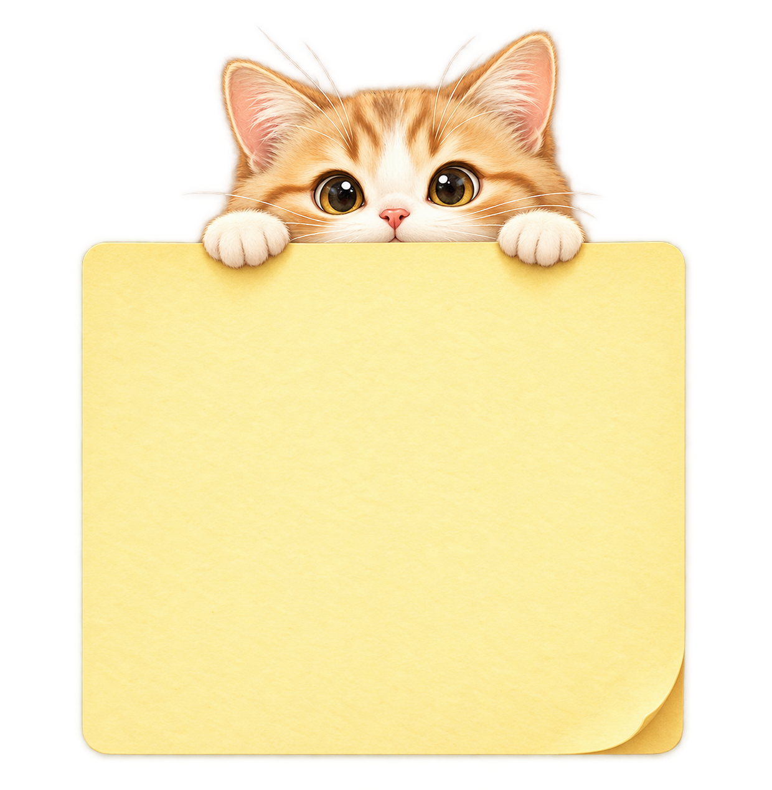

# Post-it 🐱

Um post-it de lembretes para Windows que fica na barra de tarefas e **pisca quando há tarefa pendente no dia** — para não precisar lembrar de conferir, nem deixar uma nota aberta por cima das outras janelas.



## O que faz

- **Alerta na barra de tarefas.** Havendo pendência para hoje, o botão do app pisca em laranja e ganha um selo vermelho sobre o ícone. O ícone da bandeja (perto do relógio) também pisca.
- **Painel do dia.** Um clique abre o post-it sobre as janelas, com as tarefas de hoje e um campo para adicionar novas.
- **Fixar na tela 📌.** Por padrão a nota sai da frente sozinha ao clicar fora. Fixada, ela fica presa por cima das janelas até você desafixar — e volta no mesmo canto onde foi largada.
- **Agenda.** Toda tarefa tem data; o horário é opcional — "qualquer horário" ou uma hora marcada.
- **Notificação do Windows.** Tarefa com horário definido dispara um toast na hora marcada.
- **Quadro "Ver todos".** Mostra os agendamentos futuros como post-its espalhados, que podem ser arrastados e ficam onde você soltar.
- **Inicia com o Windows** (pode ser desligado no menu do ícone da bandeja).

## Como rodar

Precisa de [Node.js](https://nodejs.org) instalado.

```bash
npm install
npm start
```

Os ícones já vêm gerados em `assets/`. Para regerá-los a partir de outra arte de
post-it (basta trocar `assets/postit-cat.png`), rode no PowerShell:

```powershell
powershell -File scripts/slice-cat.ps1   # fatia a arte em topo / meio / base
powershell -File scripts/gen-tray.ps1    # gera os ícones da bandeja e do app
```

## Uso

| Ação | Como |
|---|---|
| Abrir o post-it | Clicar no ícone do gatinho na barra de tarefas ou na bandeja |
| Fechar / sair da frente | Clicar fora, ou no ✕ — minimiza e continua na barra |
| Fixar / desafixar | Botão 📌 no post-it (fica laranja quando fixado) ou o menu da bandeja |
| Nova tarefa | Digitar, escolher a data, marcar `hora?` se tiver horário, e Adicionar |
| Concluir | Clicar na bolinha ao lado da tarefa |
| Ver agendamentos futuros | Botão **Ver todos** |
| Iniciar com o Windows / Sair | Botão direito no ícone da bandeja |

## Onde ficam os dados

As tarefas ficam em `tasks.json`, dentro da pasta de dados do app no Windows
(`%APPDATA%/Post-it/`). Nada sai da máquina — não há servidor nem conta.

## Estrutura

```
main.js              processo principal: bandeja, barra de tarefas, alertas, notificações
preload.js           ponte segura entre a interface e o processo principal
store.js             persistência das tarefas em JSON
renderer/panel.*     painel "Hoje" (janela transparente)
renderer/board.*     quadro com os post-its espalhados
scripts/             geração dos ícones e o fatiamento da arte do post-it
```

A arte do post-it é fatiada em três (cabeça do gatinho, meio esticável e base com a
dobrinha) para a nota crescer conforme a lista sem distorcer o gatinho.
